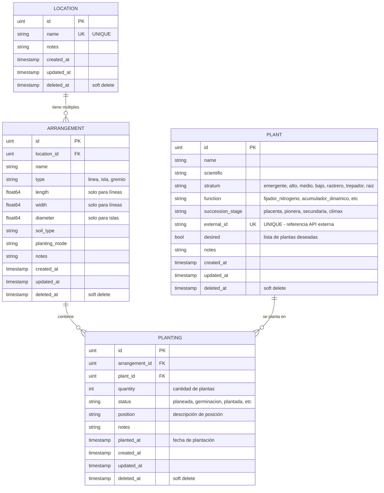
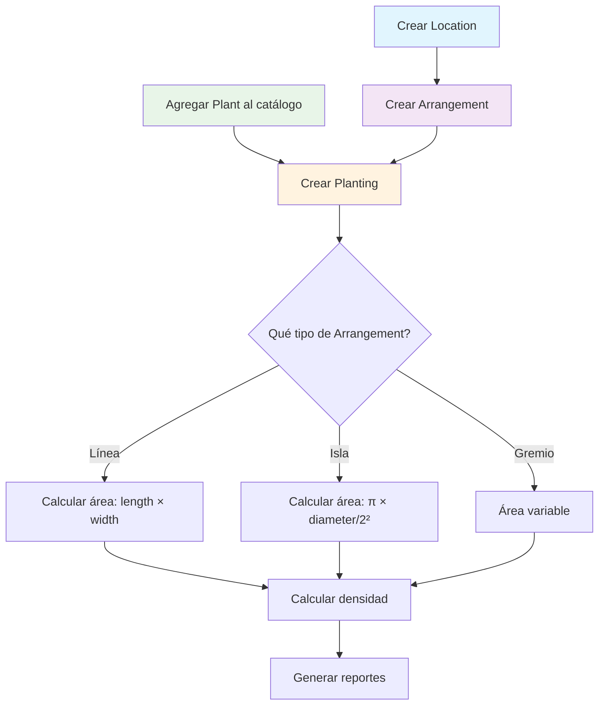
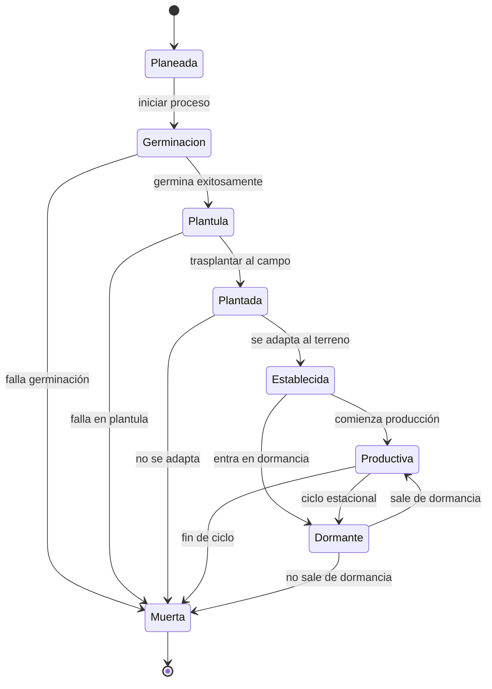
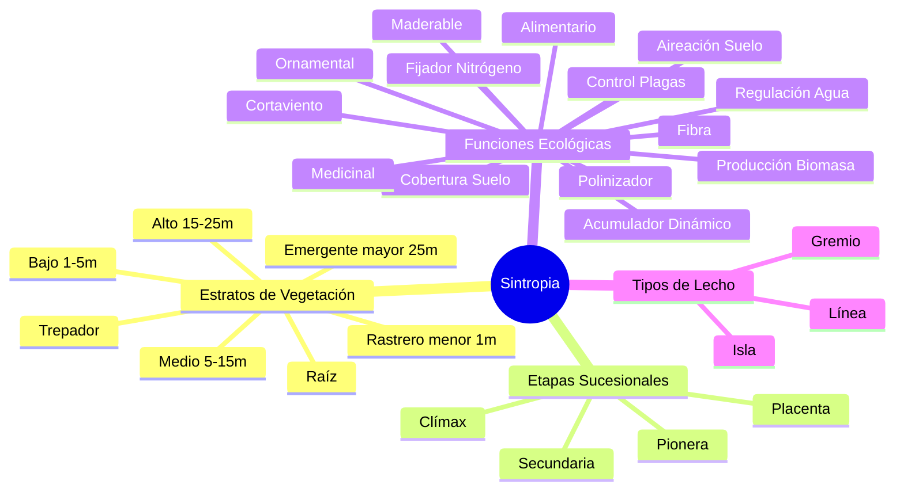

# 🌱 Diagrama Mermaid - Modelo de Datos Sintropia

## 📊 Diagrama de Entidad-Relación (Mermaid)



## 🔄 Diagrama de Flujo de Proceso



## 🎯 Diagrama de Estados de Plantación



## 📋 Constantes del Sistema



## 🚀 Para visualizar estos diagramas:

### **Opción 1: GitHub/GitLab**
- Los archivos `.md` con Mermaid se renderizan automáticamente

### **Opción 2: Mermaid Live Editor**
- Ir a: https://mermaid.live/
- Copiar y pegar el código Mermaid

### **Opción 3: VS Code**
- Instalar extensión "Mermaid Preview"
- Abrir archivo `.md` y usar preview

### **Opción 4: Generar PNG con Python**
```bash
pip install graphviz
python docs/generate-diagram.py
```