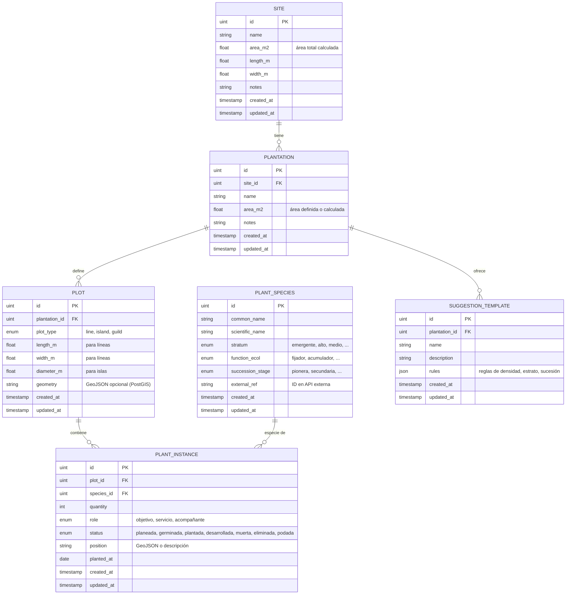
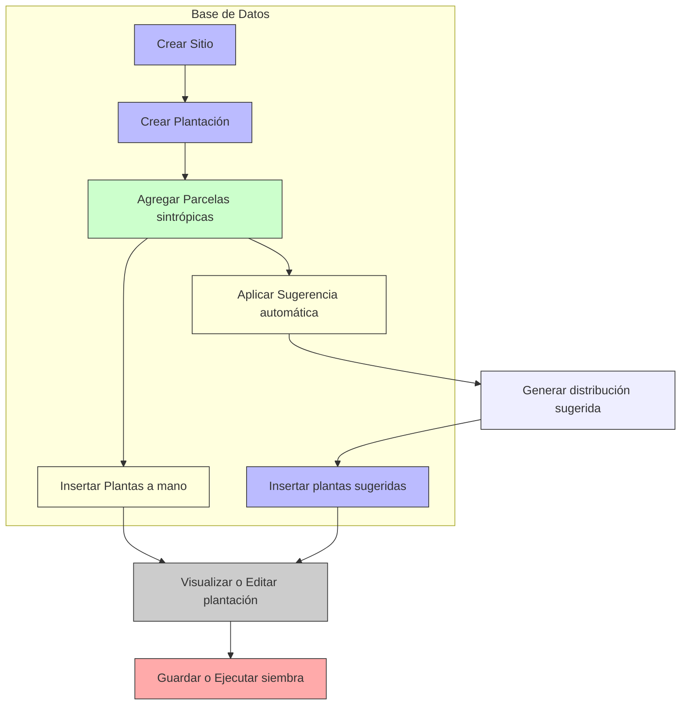
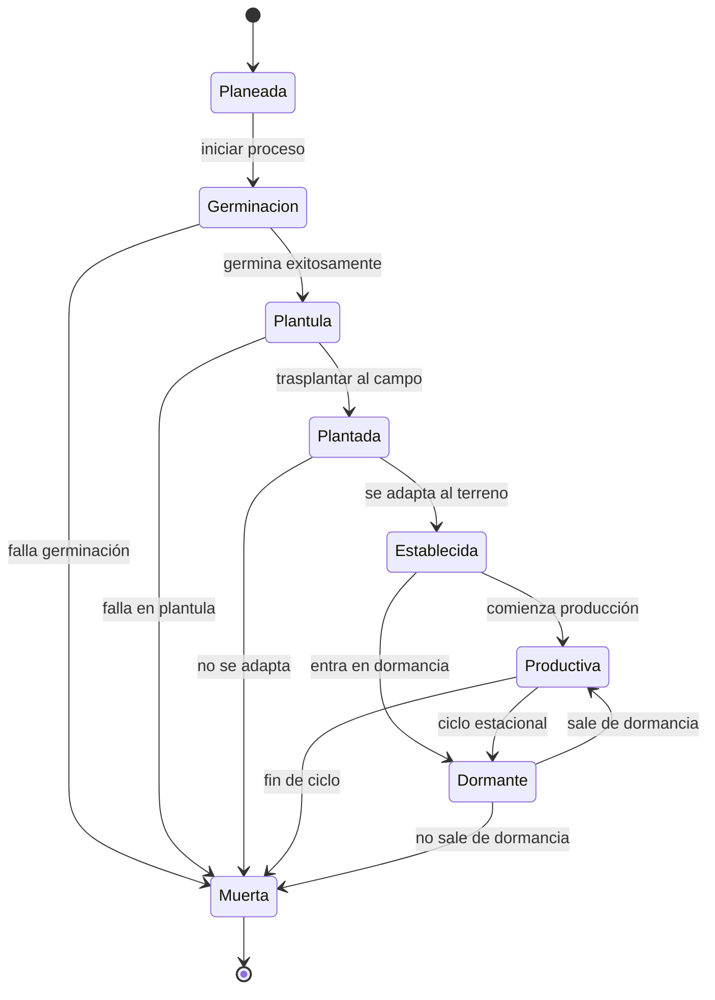
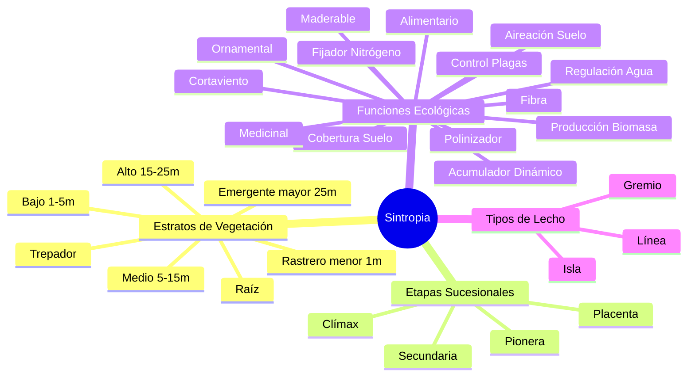

# 🌱 Diagrama Mermaid - Modelo de Datos Sintropia

## 📊 Diagrama de Entidad-Relación (Mermaid)

## 🔄 Diagrama de Flujo de Proceso

## 🎯 Diagrama de Estados de Plantación

## 📋 Constantes del Sistema

